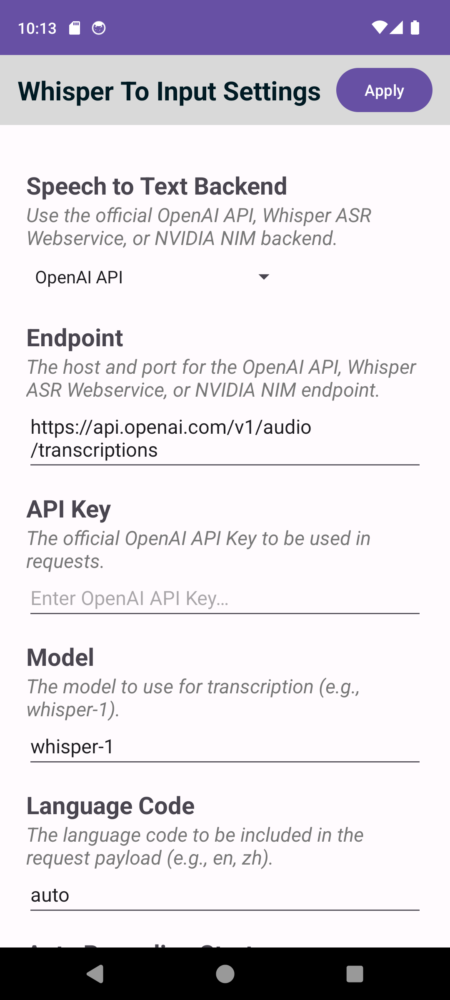
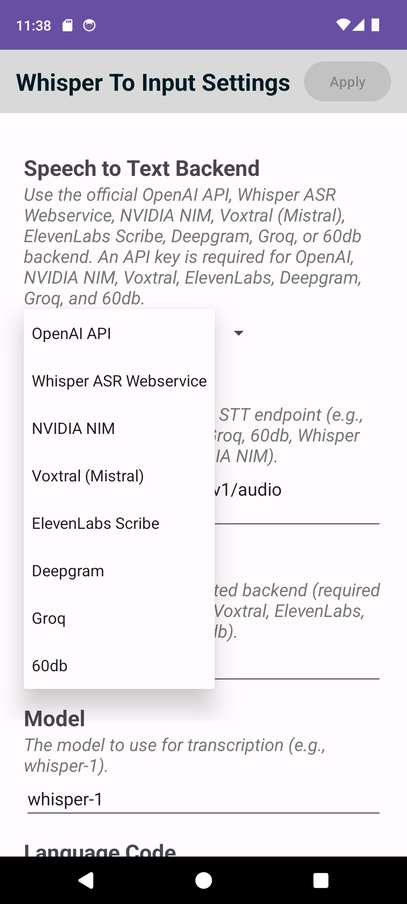
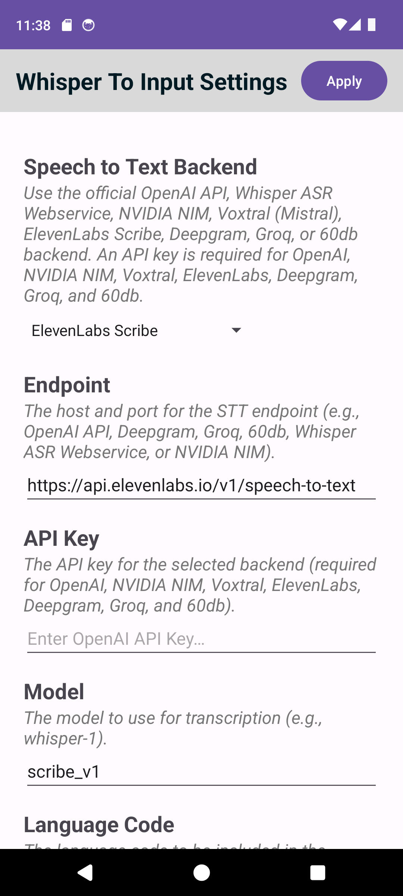
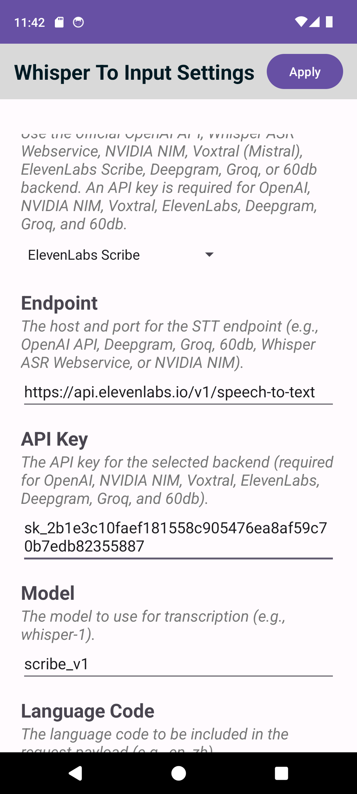
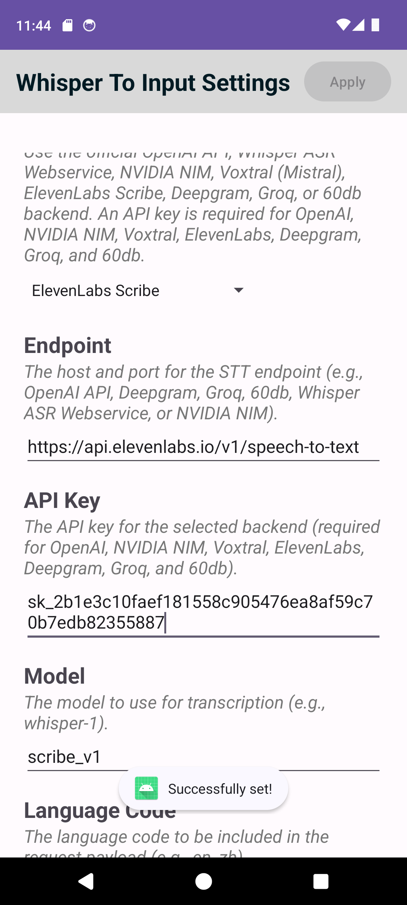

# Whisper To Input: ElevenLabs Scribe E2E Test

*2026-07-13T20:14:49Z by Showboat 0.6.1*
<!-- showboat-id: c0695cde-4b6a-4fa7-9a15-4b7920c0d7b1 -->

This document proves that the Whisper To Input Android keyboard correctly transcribes speech using the ElevenLabs Scribe API. Test audio: test-sources/test-audio.wav (5s, recorded voice). Expected transcription: 'Hello? What's going on?'.

```bash
curl -s -X POST 'https://api.elevenlabs.io/v1/speech-to-text' -H 'xi-api-key: sk_2b1e3c10faef181558c905476ea8af59c70b7edb82355887' -F 'file=@test-sources/test-audio.wav' -F 'model_id=scribe_v1' -F 'language_code=en' | jq -r '.text'
```

```output
Hello? What's going on?
```

```bash {image}
/tmp/evidence.png
```



```bash {image}
thoughts/shared/showboat/dropdown-providers.png
```



```bash {image}
thoughts/shared/showboat/elevenlabs-defaults.png
```



```bash {image}
thoughts/shared/showboat/elevenlabs-configured.png
```



```bash {image}
thoughts/shared/showboat/elevenlabs-successfully-set.png
```



Screenshot 1: Dropdown showing all available STT providers including Voxtral (Mistral) and ElevenLabs Scribe

Screenshot 2: ElevenLabs Scribe selected with correct default values (endpoint: https://api.elevenlabs.io/v1/speech-to-text, model: scribe_v1)

Screenshot 3: ElevenLabs Scribe configured with API key entered

Screenshot 4: Settings successfully applied (toast message 'Successfully set!')
